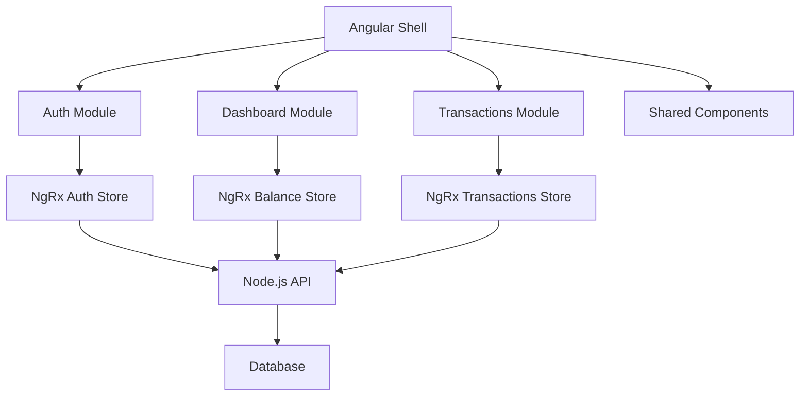

# 💰 Sistema de Gestão Financeira - ByteBank

<div align="center">
  
  
  
  
  
</div>

<br/>

<div align="center">
  <h3>🚀 Aplicação Moderna de Gestão Financeira com Arquitetura Microfrontend</h3>
  <p>Desenvolvido como parte do <strong>Tech Challenge - Fase 02</strong> do curso pós Front-end Engineering</p>
</div>

---

## 📋 Índice

- [📝 Sobre o Projeto](#-sobre-o-projeto)
- [🏗️ Arquitetura](#️-arquitetura)
- [🎯 Funcionalidades](#-funcionalidades)
- [🛠️ Tecnologias](#️-tecnologias)
- [📦 Instalação](#-instalação)
- [🚀 Deploy](#-deploy)
- [♿ Acessibilidade](#-acessibilidade)
- [🧪 Testes](#-testes)
- [📚 Documentação](#-documentação)
- [👥 Equipe](#-equipe)

---

## 📝 Sobre o Projeto

O **ByteBank** é uma aplicação web moderna para **gerenciamento financeiro pessoal**, desenvolvida com foco em:

- 🎨 **UX/UI Moderna**: Interface intuitiva e responsiva
- 🔒 **Segurança**: Autenticação robusta com NgRx
- ♿ **Acessibilidade**: Conformidade com WCAG 2.1
- 🏗️ **Arquitetura Escalável**: Microfrontend com padrões modernos
- 🚀 **Deploy Automatizado**: CI/CD com AWS

---

## 🏗️ Arquitetura

### Microfrontend Architecture



### Tecnologias Core

- **Frontend**: Angular 17+ com Standalone Components
- **Estado**: NgRx para gerenciamento de estado reativo
- **Backend**: Node.js API REST (substituindo JSON Server)
- **Containerização**: Docker & Docker Compose
- **Deploy**: AWS (ECR, ECS, CloudFront, S3)

---

## 🎯 Funcionalidades

### 🔐 Autenticação e Segurança
- ✅ Sistema de login com JWT
- ✅ Auto-logout por inatividade
- ✅ Refresh token automático
- ✅ Guards de rota com NgRx
- ✅ Interceptors para tratamento de erros

### 💼 Gestão Financeira
- ✅ Dashboard com resumo financeiro
- ✅ Gráficos interativos das transações
- ✅ CRUD completo de transações
- ✅ Filtros avançados por data/categoria
- ✅ Exportação de relatórios

### 🎨 Interface e UX
- ✅ Design System consistente
- ✅ Dark/Light Theme
- ✅ Layout responsivo (Mobile-first)
- ✅ Animações e micro-interações
- ✅ PWA (Progressive Web App)

### ♿ Acessibilidade
- ✅ Navegação completa por teclado
- ✅ Suporte para leitores de tela
- ✅ Contrastes adequados (WCAG 2.1 AA)
- ✅ Semântica HTML5 e ARIA labels
- ✅ Focus management

---

## 🛠️ Tecnologias

### Frontend
- **Angular 17+** - Framework principal
- **NgRx** - Gerenciamento de estado
- **Tailwind CSS** - Estilização utilitária
- **Angular Material** - Componentes UI
- **Chart.js** - Gráficos interativos
- **RxJS** - Programação reativa

### Backend & DevOps
- **Node.js** - Runtime do servidor
- **Express.js** - Framework web
- **JWT** - Autenticação
- **Docker** - Containerização
- **GitHub Actions** - CI/CD

### Cloud & Deploy
- **AWS ECR** - Registry de containers
- **AWS ECS** - Orquestração de containers
- **AWS CloudFront** - CDN global
- **AWS S3** - Storage estático
- **AWS CodeBuild/CodePipeline** - Build e deploy

### Qualidade & Testes
- **Jest** - Testes unitários
- **Cypress** - Testes E2E
- **ESLint** - Linting
- **Prettier** - Formatação
- **Husky** - Git hooks

### Documentação
- **Storybook** - Documentação de componentes
- **Figma** - Design System
- **JSDoc** - Documentação de código

---

## 📦 Instalação e Execução

### ✅ Pré-requisitos

- Node.js (versão recomendada: LTS)
- npm (gerenciador de pacotes)
- Angular CLI

### ✅ Passos para rodar o projeto:

1. **Clone o repositório:**

```bash
git clone https://github.com/3frnt-group6-tc1/Tech-Challange-1 <folder-name>
cd <folder-name>
```

2. **Instale as dependências:**

```bash
npm install
```

3. **(Opcional) Configure e execute a API Node.js localmente:**

```bash
# Clonar backend em outro diretório
git clone https://github.com/dvsilva/tech-challenge-2 backend
cd backend

# Instalar dependências
pm install

# Copiar variáveis de ambiente
cp .env.example .env
# Ajustar variáveis se desejar (MongoDB opcional: usa memória se não informado)

# Rodar em desenvolvimento
npm run dev

# Ou produção
npm start
```

4. **Execute o projeto Angular em ambiente de desenvolvimento:**

```bash
ng serve
```

5. **Acesse no navegador:**

```bash
http://localhost:4200
```

### 🧩 Microfrontend de Autenticação (Login, Home, Registro)

O módulo de autenticação (login, tela de registro e página inicial) foi extraído para um microfrontend próprio. Repositório:

https://github.com/3frnt-group6-tc1/Tech-Challange-2-MicroFront

Passos rápidos para rodar localmente:

```bash
# Clonar o microfrontend em outro diretório
git clone https://github.com/3frnt-group6-tc1/Tech-Challange-2-MicroFront auth-mfe
cd auth-mfe

# Instalar dependências
npm install

# Iniciar em modo desenvolvimento
ng serve
```

Aplicação disponível em:

```
http://localhost:4300/
```

### 🔐 Usuários de Teste

| Email | Senha |
|-------|-------|
| joao.silva@email.com | senha123 |
| maria.souza@email.com | senha456 |
| carlos.lima@email.com | senha789 |
| ana.pereira@email.com | senha321 |
| lucas.oliveira@email.com | senha654 |
| mariano.oliveira@email.com | senha435 |

> ℹ️ **Observação**: o sistema de login agora consome nossa API Node.js (`/users/auth`) e os dados de autenticação estão armazenados em um banco **MongoDB**. O mock anterior com **JSON Server** foi descontinuado.

---

### ✅ Documentação

1. **Execute o storybook:**

```bash
npm run storybook
```

2. **Acesse no navegador:**

```bash
http://localhost:6006
```

### ✅ Observações

## Testes Unitários

1. **Executar todos os testesk:**

```bash
ng test
```

2. **Executar testes específicos:**

```bash
ng test --include="**/not-found.component.spec.ts"
```

---

## 🧑‍💻 Equipe de Desenvolvimento

Este projeto foi desenvolvido em grupo por:

<table>
  <tr>
    <td align="center"><b>Matheus Althman Hespagnola</b></td>
    <td align="center"><b>João Víctor Zinatto Sobral</b></td>
    <td align="center"><b>Vinícius Batista Rocha Santos</b></td>
    <td align="center"><b>Christian Fernando Borges Pereira</b></td>
    <td align="center"><b>Danyllo Valente da Silva</b></td>
  </tr>
  <tr>
    <td align="center">
      <a href="https://github.com/Mat-hespa">
        <br/>
        Mat-hespa
      </a>
    </td>
    <td align="center">
      <a href="https://github.com/joohzinato">
        <br/>
        joohzinato
      </a>
    </td>
    <td align="center">
      <a href="https://github.com/AJK-Vinicius">
        <br/>
        AJK-Vinicius
      </a>
    </td>
    <td align="center">
      <a href="https://github.com/Christian-Fernando993">
        <br/>
        Christian-Fernando993
      </a>
    </td>
    <td align="center">
      <a href="https://github.com/dvsilva">
        <br/>
        dvsilva
      </a>
    </td>
  </tr>
</table>

---
