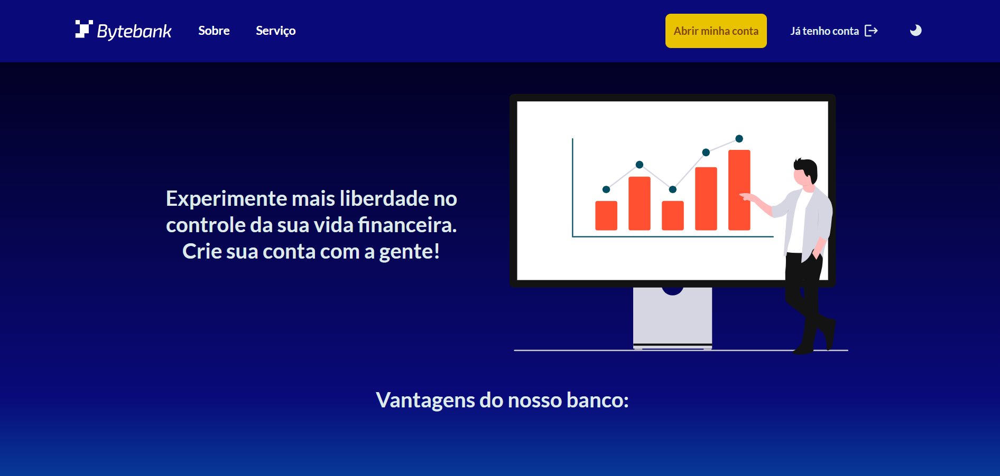
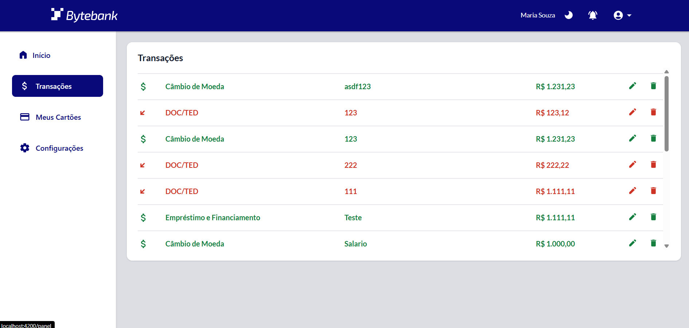
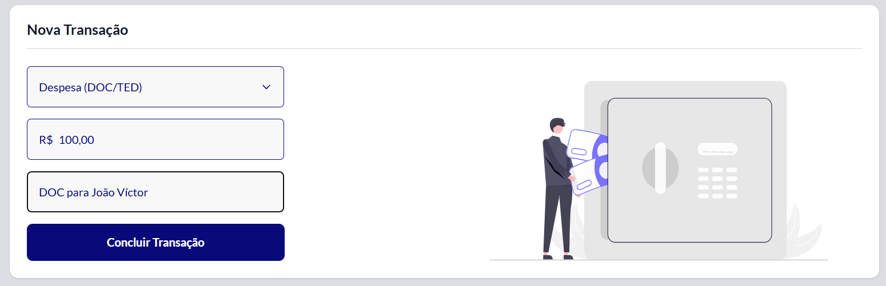
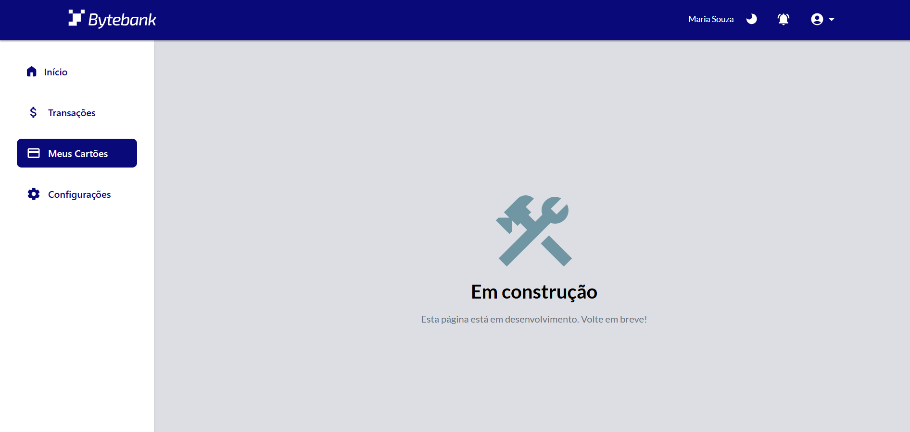
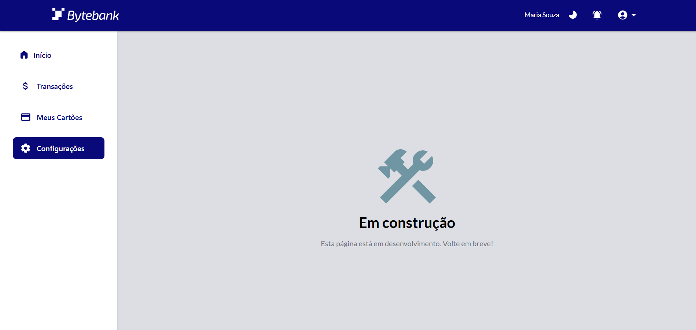
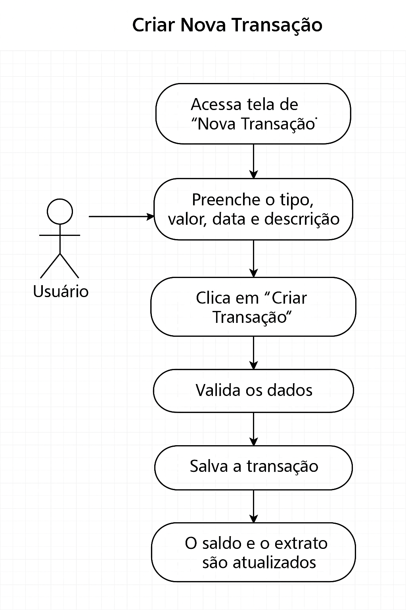
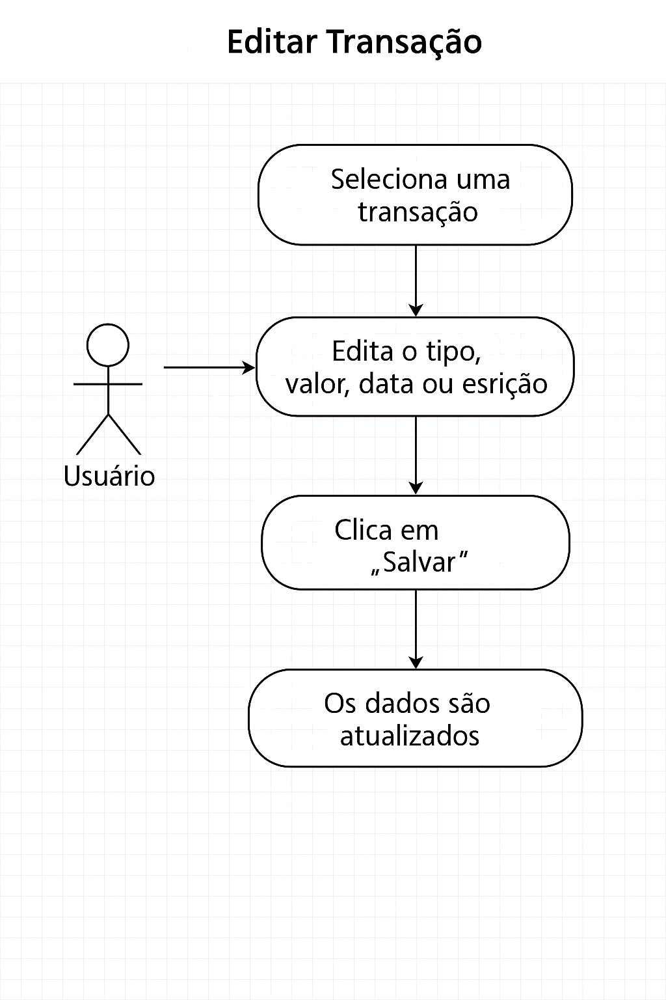
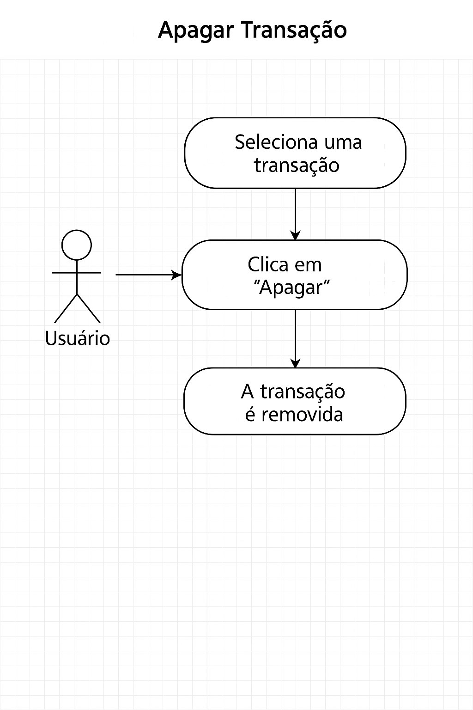

# Manual do Sistema de Gestão Financeira

## Introdução

Este manual tem como objetivo orientar o usuário no uso do Sistema de Gestão Financeira, desenvolvido para facilitar o controle de transações financeiras pessoais. O sistema permite visualizar, adicionar, editar e excluir transações, além de apresentar gráficos e resumos financeiros de forma simples e intuitiva.

---

## Descrição Geral do Sistema

O sistema foi desenvolvido como parte do Tech Challenge do curso de pós-graduação em Front-end Engineering, utilizando as tecnologias Angular, Tailwind CSS, Storybook, Figma (Design System) e JSON Server para backend.

---

## Instalação e Execução

### Pré-requisitos

- Node.js (versão recomendada: LTS)
- npm (gerenciador de pacotes)
- Angular CLI

### Passos para rodar o projeto

1. Clone o repositório:
   ```bash
   git clone https://github.com/3frnt-group6-tc1/Tech-Challange-1 <nome-da-pasta>
   cd <nome-da-pasta>
   ```
2. Instale as dependências:
   ```bash
   npm install
   ```
3. Execute a API backend:
   ```bash
   npm run server
   ```
4. Execute o projeto em ambiente de desenvolvimento:
   ```bash
   ng serve
   ```
5. Acesse no navegador:
   http://localhost:4200

### Documentação dos Componentes

1. Execute o storybook:
   ```bash
   npm run storybook
   ```
2. Acesse no navegador:
   http://localhost:6006

---

## Modelagem do Sistema

### Modelo Conceitual

O sistema possui duas entidades principais:

- **Usuário**: responsável por cadastrar e gerenciar suas próprias transações.
- **Transação**: representa cada movimentação financeira realizada pelo usuário.

Relacionamentos:

- Um usuário possui muitas transações.
- Cada transação pertence a um único usuário.

#### Atributos das Entidades

**Usuário**

- id_usuario (PK)
- nome
- email
- senha

**Transação**

- id_transacao (PK)
- tipo (depósito, saque, transferência)
- valor
- data
- descrição
- id_usuario (FK)

### Modelo Lógico

**Usuário**
| Campo | Tipo | Chave | Descrição |
|------------|----------|-------|-------------------------------|
| id_usuario | INTEGER | PK | Identificador único do usuário |
| nome | VARCHAR | | Nome completo do usuário |
| email | VARCHAR | | E-mail do usuário |
| senha | VARCHAR | | Senha criptografada do usuário |

**Transação**
| Campo | Tipo | Chave | Descrição |
|--------------|----------|-------|------------------------------------------|
| id_transacao | INTEGER | PK | Identificador único da transação |
| tipo | VARCHAR | | Tipo de transação (depósito, saque, etc) |
| valor | DECIMAL | | Valor financeiro da transação |
| data | DATE | | Data em que a transação ocorreu |
| descricao | VARCHAR | | Texto opcional com detalhes |
| id_usuario | INTEGER | FK | Relacionamento com o usuário (FK) |

---

## Prints do Sistema

A seguir, apresentamos exemplos visuais das principais telas do sistema para facilitar o entendimento do funcionamento da aplicação. As imagens ilustram o fluxo de uso e as funcionalidades disponíveis para o usuário.

### Tela Principal - Landing Page

<!-- Substitua pelo print real quando disponível -->


_Exemplo de tela de autenticação do usuário._

### Tela Principal

<!-- Substitua pelo print real quando disponível -->


_Resumo do saldo, extrato das últimas transações e gráficos do mês._

### Tela de Listagem de Transações

<!-- Substitua pelo print real quando disponível -->


_Visualização de todas as transações cadastradas, com opções de editar e excluir._

### Modal de Edição e Exclusão de Transação

<!-- Substitua pelo print real quando disponível -->


_Formulário para adicionar ou editar uma transação financeira._

### Tela de Meus Cartões

<!-- Substitua pelo print real quando disponível -->


_Cartões do usuário logado._

### Tela de Configurações

<!-- Substitua pelo print real quando disponível -->


_Configurações de preferências do usuário e opções do sistema._

---

## Casos de Uso

### Caso de Uso 1 — Criar Nova Transação



**Título:** Criar uma nova transação  
**Ator principal:** Usuário autenticado  
**Pré-condição:** O usuário deve estar logado no sistema  
**Descrição:** O usuário preenche os dados de uma nova transação e salva no sistema.

**Fluxo Principal:**

1. O usuário acessa a tela de "Nova Transação".
2. O sistema exibe um formulário com campos: tipo de transação (depósito, saque, transferência), valor, data e descrição (opcional).
3. O usuário preenche os campos e clica em "Criar Transação".
4. O sistema valida os dados.
5. O sistema salva a transação associando ao ID do usuário.
6. O saldo e o extrato são atualizados.

**Fluxo Alternativo:**

- Se os dados forem inválidos, o sistema exibe mensagens de erro e não realiza o salvamento.

---

### Caso de Uso 2 — Editar uma Transação



**Título:** Editar transação existente  
**Ator principal:** Usuário autenticado  
**Pré-condição:** O usuário deve estar logado e ser o criador da transação  
**Descrição:** O usuário pode alterar os dados de uma transação já existente.

**Fluxo Principal:**

1. O usuário acessa a lista de transações.
2. Clica no botão "Editar" da transação desejada.
3. O sistema exibe os dados atuais no formulário.
4. O usuário edita os campos (tipo, valor, data ou descrição).
5. Clica em "Salvar alterações".
6. O sistema valida e atualiza os dados no banco.
7. O saldo e o extrato são atualizados.

**Fluxo Alternativo:**

- Se os dados forem inválidos, o sistema informa os erros e cancela a atualização.

---

### Caso de Uso 3 — Excluir uma Transação



**Título:** Excluir transação  
**Ator principal:** Usuário autenticado  
**Pré-condição:** O usuário deve estar logado e ser o criador da transação  
**Descrição:** O usuário pode excluir uma transação que ele mesmo criou.

**Fluxo Principal:**

1. O usuário acessa a lista de transações.
2. Clica no ícone ou botão "Excluir" da transação.
3. O sistema exibe uma confirmação: "Tem certeza que deseja excluir?"
4. O usuário confirma.
5. O sistema remove a transação do banco.
6. O saldo e o extrato são atualizados.

**Fluxo Alternativo:**

- Se o usuário cancelar a exclusão, nenhuma ação é feita.

---

Em caso de dúvidas, consulte a documentação do projeto ou entre em contato com a equipe de desenvolvimento.
